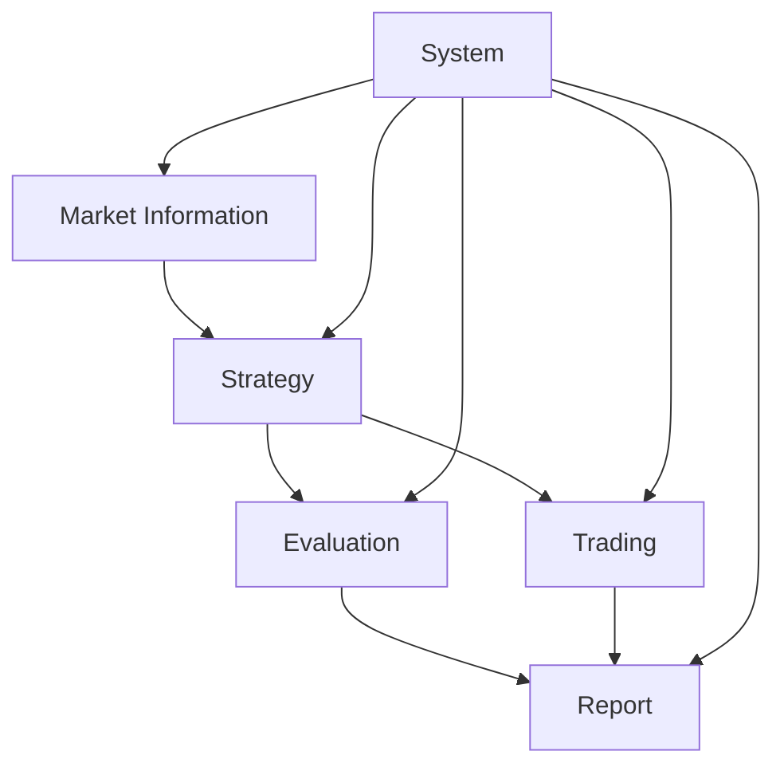

# System Patterns: Online Learning Trading System

## Architecture Overview
The Online Learning Trading System follows a modular, component-based architecture with clear separation of concerns. Each major function is encapsulated in its own module, allowing for independent development, testing, and deployment.

## Core Design Patterns

### 1. Repository Pattern
- Used for data access and persistence
- Abstracts the details of data storage and retrieval
- Implemented in market_information and strategy modules

### 2. Strategy Pattern
- Used for implementing different trading strategies
- Allows for swapping algorithms at runtime
- Enables easy addition of new strategies

### 3. Factory Pattern
- Used for creating strategy and model instances
- Centralizes object creation logic
- Supports dependency injection

### 4. Observer Pattern
- Used for event handling in the trading module
- Allows components to subscribe to events (price changes, trade executions)
- Decouples event producers from consumers

### 5. Adapter Pattern
- Used for integrating with external APIs and data sources
- Provides a consistent interface to diverse external systems
- Implemented in market_information and trading modules

## Component Relationships

### Market Information Module
- Collects and processes market data
- Provides data to the Strategy module
- Interfaces with external data sources

### Strategy Module
- Develops and trains trading models
- Generates trading signals
- Consumes data from Market Information
- Provides signals to Evaluation and Trading

### Evaluation Module
- Backtests strategies using historical data
- Evaluates strategy performance
- Consumes signals from Strategy
- Provides results to Report

### Trading Module
- Executes trades based on strategy signals
- Manages order lifecycle
- Interfaces with trading venues
- Provides execution data to Report

### Report Module
- Generates performance reports
- Creates alerts based on predefined conditions
- Consumes data from Evaluation and Trading

### System Module
- Provides configuration and utilities
- Manages system-wide settings
- Supports logging and error handling

## Data Flow
1. Market data is collected and processed by the Market Information module
2. Processed data is fed into the Strategy module
3. Strategy module generates trading signals
4. Signals are evaluated by the Evaluation module and/or executed by the Trading module
5. Results are reported by the Report module

## Code Organization
- Each module follows a consistent structure
- Clear separation between interfaces and implementations
- Use of Python packages to organize related functionality
- Consistent naming conventions and coding standards

## Testing Approach
- Unit tests for individual components
- Integration tests for module interactions
- System tests for end-to-end workflows
- Dedicated test directory with parallel structure to source code